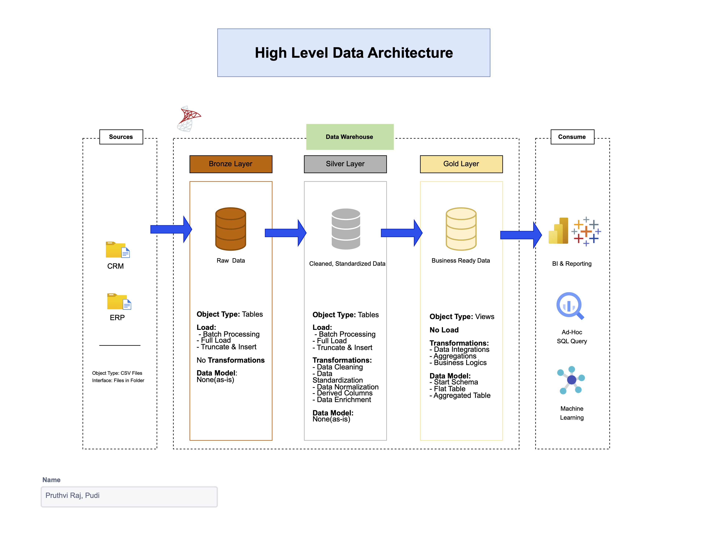
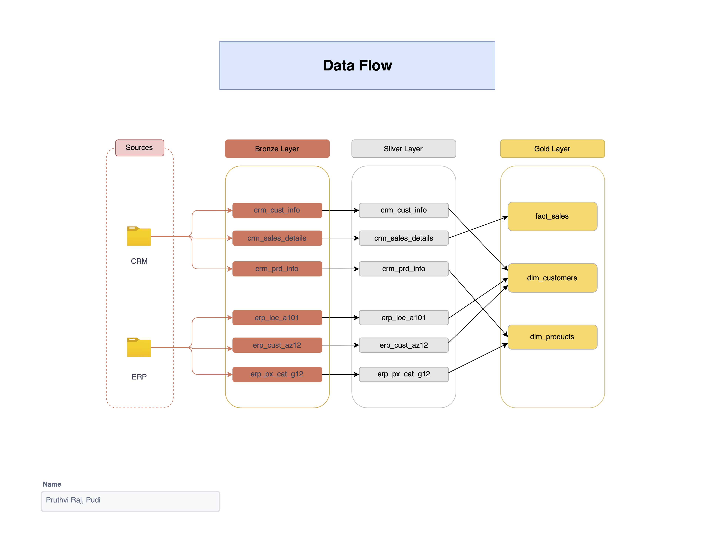

# Data Warehouse Project 

Welcome to the **Data Warehouse Project** — an end-to-end **data engineering solution** built using **SQL Server** and **T-SQL**. This project demonstrates how to design and implement a **modern data warehouse** that transforms raw source data into structured, business-ready datasets using a **layered Medallion Architecture**. It focuses on **data ingestion**, **transformation**, **data modeling**, and **data quality validation**, following real-world best practices used in enterprise data engineering.  

---

## 🏗️ Data Architecture  

The solution is designed using the **Medallion Architecture** (Bronze → Silver → Gold) — a layered framework for building reliable and scalable data pipelines.  



| Layer | Description | Purpose |
|:------|:-------------|:----------|
| **🥉 Bronze Layer** | Raw data ingested from CRM and ERP CSV files | Preserves original source data for traceability and auditing |
| **🥈 Silver Layer** | Cleaned, standardized, and integrated datasets | Improves data quality and consistency across systems |
| **🥇 Gold Layer** | Business-ready Star Schema (Fact + Dimensions) | Supports analytics, reporting, and dashboarding |

Each layer adds more structure, quality, and business context, ensuring a **trustworthy data foundation** for future analytics and reporting.  

---

## 📘 Project Overview  

This project demonstrates:  
- **Data Architecture Design** – Structured multi-layered data warehouse using SQL Server schemas (bronze, silver, gold).  
- **ETL Development** – Automated extraction, transformation, and loading using **T-SQL stored procedures**.  
- **Data Modeling** – Built a **Star Schema** for business-ready datasets (dimensions & facts).  
- **Data Quality Management** – Implemented validation and integrity checks across layers.  
- **Documentation & Cataloging** – Created data catalogs, ER diagrams, and architecture visuals.  

---

## Project Features  

### Data Warehouse Development  
- Integrated multiple **data sources (ERP and CRM)** into SQL Server.  
- Used `BULK INSERT` and stored procedures to automate data ingestion.  
- Created **layered schemas** (`bronze`, `silver`, `gold`) for maintainable pipelines.  

### ETL Workflow  
- Extracted data from CSVs and loaded it into staging (bronze) tables.  
- Transformed data in silver layer (cleaning, standardizing, normalizing).  
- Created gold layer views representing **fact and dimension tables**.  

### Data Quality Checks  
- Applied validation to detect nulls, duplicates, and invalid data.  
- Ensured referential integrity between dimension and fact tables.  
- Built SQL scripts to monitor data completeness and consistency.  

### Documentation and Governance  
- Designed **architecture**, **data flow**, and **data model** diagrams.  
- Created a **data catalog** describing each table and column in the gold layer.  
- Followed consistent **naming conventions** and schema standards.  

---

## 🧱 Data Model – Star Schema  

.png)

| Table | Type | Description |
|:------|:------|:-------------|
| **dim_customers** | Dimension | Customer demographic and regional data |
| **dim_products** | Dimension | Product catalog including category, cost, and product line |
| **fact_sales** | Fact | Transactional sales data linking customers and products |

**Relationships:**  
- 1-to-many between dimensions and the fact table.  
- Surrogate keys generated using `ROW_NUMBER()` for stable joins.  

---

## 🔄 Data Flow  



---

## 🧰 Tools & Technologies  

| Category | Tool |
|:----------|:------|
| **Database Engine** | Microsoft SQL Server 2019 |
| **Query Language** | T-SQL |
| **ETL Orchestration** | Stored Procedures |
| **Data Modeling** | Draw.io, ER Diagrams |
| **Version Control** | Git / GitHub |

---

## 📂 Repository Structure  

```
sql-data-warehouse-project/
│
├── datasets/                # Raw datasets from ERP and CRM systems
│   ├── source_crm/          # CRM source data
│   │   ├── cust_info.csv    # Customer information
│   │   ├── prd_info.csv     # Product information
│   │   └── sales_details.csv # Sales details
│   ├── source_erp/          # ERP source data
│   │   ├── cust_az12.csv    # Customer AZ12 data
│   │   ├── loc_a101.csv     # Location data
│   │   └── px_cat_g12.csv   # Product category data
│
├── docs/                    # Documentation and architecture diagrams
│   ├── data_architecture.png  # Medallion architecture diagram
│   ├── data_catalog.md      # Data dictionary for the Gold layer tables
│   ├── data_flow.png        # Data flow diagram
│   ├── data_integration.png # Integration process diagram
│   ├── data_model(star_schema).png  # Star schema diagram
│
├── scripts/                 # SQL scripts for ETL and transformations
│   ├── bronze/              # Scripts for raw data ingestion
│   │   ├── ddl_bronze.sql   # Bronze layer table definitions
│   │   └── proc_load_bronze.sql # Bronze layer ETL procedures
│   ├── silver/              # Scripts for data cleaning and transformation
│   │   ├── ddl_silver.sql   # Silver layer table definitions
│   │   ├── proc_load_silver.sql # Silver layer ETL procedures
│   │   └── init_database.sql # Database initialization script
│   └── gold/                # Scripts for creating analytics-ready models
│       └── ddl_gold.sql     # Gold layer table definitions
│
├── tests/                   # Test scripts for data quality checks
│   ├── quality_checks_gold.sql  # Gold layer quality checks
│   └── quality_checks_silver.sql # Silver layer quality checks
│
├── LICENSE                  # License information
└── README.md                # Project overview and instructions

```

---

## Key Learnings  

- Designed a **scalable, layered Data Warehouse** architecture.  
- Developed **ETL processes** using stored procedures and SQL transformations.  
- Modeled a **Star Schema** suitable for business analytics.  
- Implemented **data quality checks** for integrity and completeness.  
- Gained practical experience in **data governance, documentation, and schema design**.  

---

## Future Enhancements  

- Add **incremental data loading (MERGE)** for real-time updates.  
- Integrate with **Power BI** for analytics dashboards.  
- Automate ETL validation and tests using **CI/CD pipelines**.  
- Introduce **metadata-driven configurations** for flexible data ingestion.  

---

## License  

Licensed under the [MIT License](LICENSE). You’re free to use, modify, and share this project with attribution.  

---

## 🌟 About Me 

Hi, I’m **Pruthvi Raj Pudi** — a **Data Analyst & Data Engineer** passionate about building reliable data pipelines and warehouse solutions. This project reflects my expertise in **SQL development**, **data architecture**, and **ETL process automation**.  

📫 **Connect with me:**  

[](https://linkedin.com/in/pruthviirajpudi)   [](https://github.com/pruthviiraj)  


⭐ **If you found this project helpful, please give it a star!**  

---

### Summary  

> This project showcases the **design and implementation of a data warehouse** using SQL. It represents real-world data engineering principles — **structured pipelines, layered architecture, and high-quality data modeling** — forming the backbone of reliable analytics systems.

